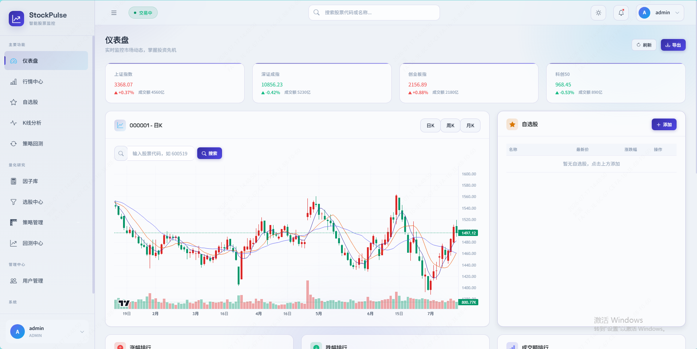
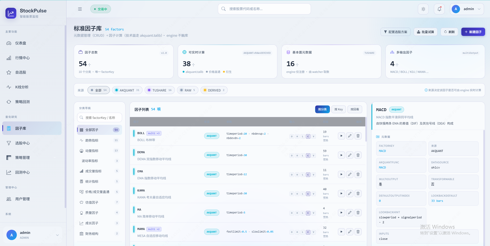
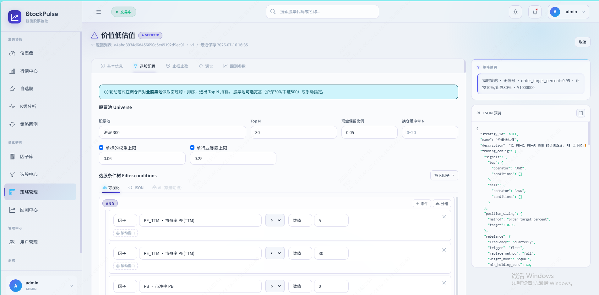

# StockPulse 📈

> **把交易经验变成可执行的规则，用历史数据验证判断，让机器替你盯盘。**

[](https://openjdk.org/)
[](https://spring.io/projects/spring-boot)
[](https://www.python.org/)
[](https://akquant.akfamily.xyz)

<!-- 项目封面图 / 截图占位 -->
<p align="center">
  <!--  -->
  <em>（项目截图位 · 待替换）</em>
</p>

面向个人 A 股投资者的**规则化量化辅助决策系统**。核心理念：**规则化 · 可解释 · 全闭环**——不引入机器学习黑箱，所有策略由透明的因子组合而成；从「看盘 → 研究 → 选股 → 策略 → 回测 → 信号 → 执行 → 复盘」一条龙打通。

---

## ✨ 核心特性

- 🔍 **多因子选股** — 规则树可视化编辑，快照 / 区间双模式，结果锁定追踪
- 🧮 **54 标准因子库** — 技术面走 [AKQuant](https://akquant.akfamily.xyz) 的 Rust 内核，口径与回测一致
- 🧩 **统一策略 Schema** — 择时（signals）/ 轮动（rebalance）双范式互斥，杜绝订单叠加Bug
- 📜 **12 个预置策略模板** — 双均线 / MACD / 红利低波 / GARP / ETF 动量轮动等，一键创建
- 📊 **回测中心** — 单次回测 / 横向对比 / 网格参数寻优 / Walk-forward 滚动验证
- 🛡️ **A 股实盘规则** — T+1、涨跌停、印花税、最小手数、point-in-time 成分股过滤
- 🔐 **企业级认证** — BCrypt + TOTP 双因素 + RBAC

<!-- 功能截图组 -->



---

## 🏗️ 架构

**Java + Python 混合架构**，HTTP/JSON 通信，数据单源性。

| 服务 | 技术栈 | 端口 | 职责 |
|------|--------|------|------|
| **stock-watcher** | Java 21 · Spring Boot 4.0.6 · MyBatis-Plus · Caffeine · Quartz | `8080` | 业务 + 数据中台：数据采集 / 认证 / 前端 / 策略管理 / 回测编排 |
| **stock-engine** | Python 3.12 · FastAPI · AKQuant 0.2.47 [Rust 核心] · Pandas | `8085` | 计算服务：因子计算 / 条件编译 / 回测引擎 / 参数优化 |

> 数据由 watcher 独占读写，engine 仅通过 HTTP 接收数据并返回 JSON，保证架构清晰。

```
┌──────────────────────────────┐
│  前端（Thymeleaf + Bootstrap 5│
│       + ECharts 5）          │
└──────────────┬───────────────┘
               │
┌──────────────▼───────────────┐    ┌────────────────────┐
│  stock-watcher（Java）       │───▶│  MySQL / SQLite    │
│  业务编排 · 数据中台         │    └────────────────────┘
└──────────────┬───────────────┘
               │ HTTP/JSON
┌──────────────▼───────────────┐
│  stock-engine（Python）      │
│  AKQuant 回测 / 因子计算     │
└──────────────────────────────┘
        ▲ Tushare Pro（watcher 直接调用，限流 + 定时同步）
```

---

## 🚀 快速开始

### 环境要求
- JDK 21+ · Node.js 16+
- Conda（Miniforge / Miniconda / Anaconda，用于 stock-engine 的 `stock` 环境）
- MySQL 8+（或用 sqlite profile）
- Tushare Pro 账号 + Token

> Maven 无需全局安装，项目自带 `mvnw` / `mvnw.cmd` Wrapper。详细启动手册见 [.trae/rules/startup.md](./.trae/rules/startup.md)。

### 首次搭建

```bash
# 1. 创建 conda env 并装 engine 依赖
conda create -n stock python=3.12 -y
node stock-engine/run.js install

# 2. 配置 watcher secret
cd stock-watcher/src/main/resources
cp application-secret.properties.template application-secret.properties
#   编辑 application-secret.properties，填 tushare.token / db.url / db.username / db.password

# 3. 全栈环境自检
cd ../../..
node run.js check-env
```

### 启动

```bash
# 一键全栈启动（engine -> watcher，后台运行 + 日志）
node run.js start

# 或开发模式（两个服务都开热重载）
node run.js start-dev

# 或单独启动
node run.js start-engine
node run.js start-watcher

# 查看状态 / 停止 / 看日志
node run.js status
node run.js stop
node run.js logs watcher     # tail watcher 日志
node run.js logs engine      # tail engine 日志
```

打开 http://localhost:8080 · 默认账号 `admin` / `admin123`

Engine API 文档：http://127.0.0.1:8085/docs

> ⚠️ 不要再用 `mvn spring-boot:run` 或 `conda run -n stock python -m uvicorn ...` 直接跑（绕过 run.js 会丢失端口检测 / 日志归档 / 健康探活）。端口冲突排查见 [startup.md](./.trae/rules/startup.md#端口配置与冲突排查)。

Tushare Token 配置在 `stock-watcher/src/main/resources/application-secret.properties`：
```properties
tushare.token=your_tushare_pro_token
```

---

## 📂 项目结构

```
stock-pulse/
├── stock-watcher/      # Java 业务服务层（:8080）
├── stock-engine/       # Python 计算服务层（:8085）
├── akquant-0.2.47/     # 锁定的 akquant 源码（知识库引用基准）
├── .trae/rules/        # AI 开发规则（编码规范 / akquant 用法）
├── .trae/specs/        # 结构化需求规格
└── CLAUDE.md           # AI 知识库根入口
```

---

## 🛣️ 路线图

- [x] **Phase 0** · 数据中台 + 行情 / 自选 / 搜索 + 认证
- [x] **Phase 1** · 因子库 + 选股中心 + 策略管理 + 回测中心 + 参数优化
- [ ] **Phase 2** · 信号中心 + 推送 + 策略实盘跟踪
- [ ] **Phase 3** · 模拟交易 + 持仓组合 + 风控中心
- [ ] **Phase 4** · 交易日志 + 收益归因 + 板块 / 情绪 / 个股深度研究

---

## 📝 License

本项目仅供个人学习研究使用。
