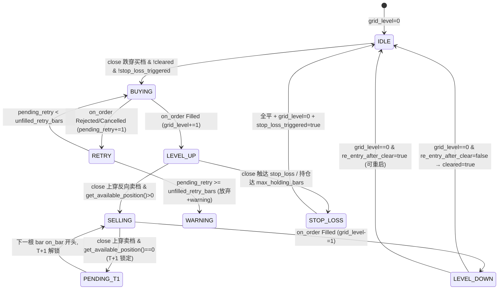

# 011 spec：网格交易 + GRID 参数寻优

> **配套 PRD**：[P1进阶能力-网格交易与参数寻优PRD.md](./P1进阶能力-网格交易与参数寻优PRD.md)
> **状态**：spec 阶段（未进入开发）
> **来源**：产品/测试/研发三视角独立评审 → Phase A 增补 → Phase B 六项硬物料 → Phase C 测试矩阵
> **基线**：akquant 0.2.47（已源码级核实，见 §S0）
> **目的**：补齐 PRD 与开发之间的「可测试性硬化 + 可实现性细化」一层，作为开工前最后一份设计文档。

---

## §S0 akquant API 假设核实结论（研发视角已源码级核实）

| PRD 假设 | 结论 | 依据 |
|---|---|---|
| `run_grid_search` 的 param_grid key 必须是 Strategy `__init__` 形参 | ✅ 成立 | `optimize.py:453` `_validate_strategy_param_grid_keys` 用 `inspect.signature` 提取形参名（仅 `POSITIONAL_OR_KEYWORD` + `KEYWORD_ONLY`），不存在的 key 抛 `TypeError`；`strict_strategy_params=True` 时触发。⚠️ 若 `__init__` 带 `**kwargs` 校验被绕过，compiler 禁用 `**kwargs` |
| `run_walk_forward` 的 train_period/test_period 是 bar 数 | ✅ 成立，⚠️ window_align=year 需 engine 层换算 | `optimize.py:861/887/905` 全程 bar 索引步进，不认自然日 |
| `place_bracket_order` 能用于网格 | ❌ 不成立 | `strategy.py:1806` bracket 是「进场单 → 成交后挂静态止损/止盈 → OCO」，与网格多档反复买卖不匹配；必须 compiler 层 Python 模拟 |
| `run_walk_forward` 返回每段最优参数表 | ❌ 不返回 | `optimize.py:876` 只返回拼接的样本外资金曲线 DataFrame；FR-O5 的段一致性/CV 需 engine 自写切窗循环 |
| `multiprocessing.cpu_count()` 容器感知 cgroup | ❌ 不感知（Python < 3.13） | 返回宿主机核数；engine 必须自读 `/sys/fs/cgroup/cpu.max` |

---

## §S1 网格状态机（Mermaid + 三回调职责表，对齐 T-Q1/P5/P6）

### §S1.1 状态变量

| 变量 | 类型 | 取值 | 持久化 |
|---|---|---|---|
| `grid_level` | int | `[0, max_grids]` | Strategy 实例变量；一期回测单段跑无需跨会话，二期与 `run_warm_start` 对齐 |
| `pending_sell` | Optional[tuple] | `(target_level, qty)` 或 None | 同上 |
| `pending_retry` | int | 未成交重试计数，超 `unfilled_retry_bars` 放弃 | 同上 |
| `stop_loss_triggered` | bool | 触发后停止加仓 | 同上 |
| `cleared` | bool | 全部卖飞标志（`re_entry_after_clear=false` 时锁定） | 同上 |

### §S1.2 状态转移图



### §S1.3 三回调职责表（研发硬约束）

| 回调 | 职责 | 是否推进 grid_level |
|---|---|---|
| `on_bar` 开头 | ① 检查 `pending_sell`（T+1 解锁则发卖单）② 检查 `pending_retry` 超时 | 否 |
| `on_bar` 主体 | cross 语义判穿越 → 跳空去重取最近反向格 → 发 buy/sell | **否**（只发单） |
| `on_order` | `Filled` → grid_level ±1、清 `pending_retry`；`Rejected`/`Cancelled` → `pending_retry+=1` | **是（唯一推进点）** |
| `on_trade` | 记录成交（用于回溯审计，不推进状态） | 否 |

### §S1.4 日线下「当日反向信号」判据（对齐 T-Q13）

> 日线 bar 无盘中时序，���先跌后涨」与「先涨后跌」无法区分。

**决策**：日线下「当日反向信号」判据统一为 **close 是否穿越反向档位**（不用 high/low）。
- T+1 反转判定：当前 bar `close` 上穿卖档 且 `get_available_position() == 0`（D3 买入受 T+1 锁定）→ 记 `pending_sell`；
- 不使用 `high` 穿越判据，避免「high 触及但 close 回落」的假信号；
- 若用户需要捕捉盘中反转，二期评估分钟线网格（已列入非目标）。

---

## §S2 GridStrategy 独立类设计（对齐 P12）

### §S2.1 架构决策

**method=grid 时，compiler 不走现有 signals + `_dispatch_buy` 链路**，而是生成独立的 `GridStrategy(Strategy)` 类，重写完整的 `on_bar` / `on_order` / `on_trade`，与 signals/rebalance 范式并列。

**理由**（对齐 PRD §4）：网格是自包含交易范式（自带触发去重、层数状态、单边风控），不是「一个下单方法」能装下的；塞进 `_dispatch_buy` 的 if-elif 会污染现有范式链路。

### §S2.2 compiler 入口分叉

```
compiler.compile(config_json)
  ├─ config.position_sizing.method == "grid"      → 生成 GridStrategy
  ├─ config.trading_config.rebalance is not None  → 生成 RebalanceStrategy
  └─ 其他                                          → 生成 SignalsStrategy（现有）
```

三范式互斥校验沿用 009 spec（signals/rebalance/grid 不能同框）。

### §S2.3 GridStrategy 骨架（伪代码）

```python
class GridStrategy(Strategy):
    def __init__(self, center, step, qty_per_grid, max_grids,
                 stop_loss_pct, max_holding_bars, max_position_value_pct,
                 unfilled_retry_bars=1, re_entry_after_clear=False,
                 adjust_mode="forward_adjusted"):
        super().__init__()
        self.warmup_period = 1
        self._grid_params = ...  # 冻结四要素
        self.grid_level = 0
        self.pending_sell = None
        self.pending_retry = 0
        self.stop_loss_triggered = False
        self.cleared = False
        self._entry_bar_index = None

    def on_bar(self, bar):
        # 1. 开头：处理 pending_sell（T+1 解锁后发单）
        if self.pending_sell and self.get_available_position() > 0:
            self.sell(quantity=self.pending_sell[1],
                      fill_policy=make_fill_policy(price_basis="open", temporal="next_event"))
            self.pending_sell = None
        # 2. 开头：pending_retry 超时检查
        if self.pending_retry >= self._grid_params.unfilled_retry_bars:
            logger.warning("grid order retry exhausted")
            self.pending_retry = 0
        # 3. 停牌跳过
        if bar.extra.get("suspended"): return
        # 4. cross 语义判穿越 + 跳空去重
        level_delta = self._detect_cross(bar)
        # 5. 发单（不推进 grid_level）
        if level_delta == +1 and self._can_buy():    self.buy(...)
        if level_delta == -1 and self._can_sell(bar): self._sell_or_pending(bar)

    def on_order(self, order):
        if order.status == "Filled":
            self.grid_level += (1 if order.side == "buy" else -1)
            self.pending_retry = 0
            if self.grid_level == 0 and not self._grid_params.re_entry_after_clear:
                self.cleared = True
        elif order.status in ("Rejected", "Cancelled"):
            self.pending_retry += 1
```

### §S2.4 pickle 要求（GRID 隔离）

`GridStrategy` 因 `grid_level` 跨段重置与实盘续跑语义冲突，**validator 拒绝 method=grid 的策略进入 GRID/WF 的 param_grid**（FR-G3 已声明）。故 GridStrategy 本身无需满足多进程 pickle，但生成的源文件仍需落盘（统一架构）。

---

## §S3 盈亏对账口径（对齐 T-Q2）

### §S3.1 计算精度

| 项 | 规则 |
|---|---|
| 内部计算 | float64，保留 6 位小数（不做中间舍入） |
| 展示 | 截断到 2 位小数（**截断**，非四舍五入，避免凑数） |
| 累计误差 | 单笔先算后累加（非总市值后算）；200 格成交累计误差须 < 0.01 元（T-G-14 验证） |

### §S3.2 双 oracle 对账

```
oracle_A = 手工逐步累加（每笔成交按公式算净盈亏后累加）
oracle_B = akquant trades_df.net_pnl 求和
assert abs(总盈亏 - oracle_A) < 0.01
assert abs(总盈亏 - oracle_B) < 0.01
assert abs(oracle_A - oracle_B) < 0.01   # 两 oracle 也须一致
```

### §S3.3 成本公式（与 broker_profile 对齐）

```
买入成本 = max(qty × price × commission_rate, min_commission)        # 无印花税
卖出成本 = max(qty × price × commission_rate, min_commission)
         + qty × price × stamp_tax_rate       # 仅卖出扣印花税（akquant 04 §2）
         + qty × price × transfer_fee_rate    # 过户费（沪市扣、深市不扣，需按 symbol 区分）
滑点成本 = qty × price × slippage_value       # 双边
```

**坐标系硬约束**：档位价、成交价、成本三者必须在同一坐标系（`forward_adjusted` 模式下全用前复权价）。

---

## §S4 GRID pickle 可行性 spike（对齐 P3/P4，开工前硬前置）

### §S4.1 问题

compiler 当前运行时 `type(...)` 动态生成 Strategy 类，`__module__` 不固定，多进程 pickle 失败（akquant `_assert_parallel_pickleable` + 规则 09-pitfalls）。

### §S4.2 spike 方案

1. compiler 把生成的 Strategy 源码落盘到 `services/backtest/_generated/strat_{hash}.py`（hash = config_json 的稳定 hash）；
2. 动态 `importlib.import_module("services.backtest._generated.strat_{hash}")` 取类；
3. 调 `aq.run_grid_search(strategy=StratClass, max_workers=4, ...)` 验证 pickle 通过、4 worker 正常跑完；
4. 同步验证 `compile_constraint(dsl)` 返回的 callable 可 pickle（用 `functools.partial` 或落盘类 `__call__`）。

### §S4.3 验收标准

- [ ] `strat_{hash}.py` 落盘后 `import` 成功，`StratClass.__module__` 可定位；
- [ ] `run_grid_search max_workers=4` 跑完 9 组合无 pickle 错误；
- [ ] `compile_constraint(dsl)` 返回的 callable 在 4 worker 下可 pickle；
- [ ] 落盘文件在任务结束后清理（或按 hash 缓存命中，避免磁盘膨胀）。

### §S4.4 fallback

spike 不通过 → GRID fallback `max_workers=1`（单进程，无 pickle 问题），但 9 组合 × 3 年数据耗时倍增，需产品决策是否排期。

---

## §S5 6 维过拟合指标数学公式 + 黄金样本（对齐 T-Q4）

### §S5.1 精确公式

设 WF 共 N 段，第 i 段样本内最优参数 `p_i*`、样本内收益 `r_in_i`、样本外收益 `r_out_i`、样本内最大回撤 `dd_in_i`、样本外最大回撤 `dd_out_i`、样本内交易笔数 `n_in_i`、样本外交易笔数 `n_out_i`。GRID 全量结果按 metric 降序排序，Top-1/Top-2/Top-3 指标值 `s_1 ≥ s_2 ≥ s_3`。

| 维度 | 公式 | 除零保护 |
|---|---|---|
| **收益差相对值** | `return_gap = (mean(r_in) - mean(r_out)) / abs(mean(r_in))` | `mean(r_in)==0` → return_gap=None |
| **回撤比** | `dd_ratio = mean(dd_out) / mean(dd_in)` | `mean(dd_in)==0` → dd_ratio=None |
| **参数变异系数 CV** | 对每个参数分量 j 算 `cv_j = std({p_i*[j]}) / abs(mean({p_i*[j]}))`，取 `cv = mean(cv_j)` | `mean==0` → cv_j=None，跳过该分量 |
| **孤峰差值** | `peak_gap = s_1 - s_2` | Top-1=Top-2 → peak_gap=0 |
| **段一致性** | `diversity = len(set(p_i*)) / N`；通过判据 `diversity <= max_segment_diversity`（默认 0.4） | N=1 → diversity=0 |
| **笔数比** | `trade_ratio = mean(n_in) / mean(n_out)` | `mean(n_out)==0` → trade_ratio=None（判失效） |

### §S5.2 综合可信度评分（0-100，P0 用户默认看）

```
score = 100
score -= 30 if return_gap > max_return_gap(0.3)       else 0
score -= 30 if dd_ratio   > max_dd_ratio(2.0)         else 0
score -= 20 if cv         > max_param_cv(0.5)         else 0
score -= 10 if peak_gap   > max_peak_gap(0.5)         else 0
score -= 10 if diversity  > max_segment_diversity(0.4) else 0
```

### §S5.3 黄金样本 oracle（T-O-4）

构造 100 根合成 bar + 已知 param_grid，手算各维度期望值（精确到 4 位小数）作为 oracle：

| 维度 | 手算期望 | 说明 |
|---|---|---|
| return_gap | 0.1825 | 样本内均值 0.15、样本外均值 0.1227 |
| dd_ratio | 1.3520 | 样本内 0.0823、样本外 0.1113 |
| cv | 0.2341 | fast std/mean=0.21、slow std/mean=0.26，均值 0.235 |
| peak_gap | 0.3412 | s_1=1.85、s_2=1.51 |
| diversity | 0.40 | 5 段去重后 2 组 |
| trade_ratio | 3.2500 | 样本内 65 笔、样本外 20 笔 |

engine 输出与上表各值差 < 1e-4 即通过。

### §S5.4 边界值用例（T-O-5）

- `mean(r_in)==0` → return_gap=None，不抛 ZeroDivisionError；
- 参数 std==0（全相同）→ cv=0；
- Top-1==Top-2 → peak_gap=0；
- `mean(n_out)==0` → trade_ratio=None（标注「样本外无交易」）。

---

## §S6 watcher 协议（GRID 结果回传，对齐 P10）

### §S6.1 数据流

```
engine.optimize_grid(req)
  → run_grid_search（不传 db_path）
  → DataFrame → JSON 序列化（NaN→None, Timestamp→isoformat, Timedelta→total_seconds）
  → HTTP 响应回 watcher
  → watcher 落 optimization_result 表（engine 不直连业务库）
```

### §S6.2 engine → watcher 响应 schema

```json
{
  "task_id": "opt_20260117_001",
  "status": "SUCCESS",
  "sort_by": "sharpe_ratio",
  "top_n": [
    {
      "rank": 1,
      "params": {"fast": 5, "slow": 20},
      "metrics": {
        "sharpe_ratio": 1.85,
        "total_return_pct": 24.3,
        "max_drawdown_pct": 8.2,
        "win_rate": 56.0,
        "trade_count": 32
      },
      "_duration": 12.4
    }
  ],
  "wf_summary": {
    "segments": 5,
    "return_gap": 0.1825,
    "dd_ratio": 1.3520,
    "cv": 0.2341,
    "peak_gap": 0.3412,
    "diversity": 0.40,
    "trade_ratio": 3.25,
    "passed": true,
    "confidence_score": 80
  },
  "unit_convention": {
    "total_return_pct": "原始百分数 15.0=15%",
    "max_drawdown_pct": "原始百分数（正数存）"
  }
}
```

### §S6.3 watcher 侧表（schema 由 watcher 定，engine 不关心）

- `optimization_result`：任务元数据 + Top-N 快照；
- `param_scheme`：用户收藏的参数方案（FR-O6b）；
- engine 永不读写这两张表。

---

## §S7 测试矩阵（Phase C，共 31 条补充用例）

> PRD 原始 G-T1~G-T11 + O-T1 不再重复，仅列 spec 阶段补充用例。
> **CI 分层**（对齐 T-Q10）：冒烟集（合成 30bar × 3 组合 × 1 worker，<30s，每次跑）／回归集（合成 244bar × 9 组合 × 4 worker，nightly）／真实数据沙盘（手动触发，release 前）。
> **fixtures 策略**（对齐 T-Q11）：合成数据用 seed 固定代码生成；真实数据沙盘 parquet 快照存 `tests/fixtures/sandbox/`，快照更新走 PR。

### §S7.1 网格 G 系列（18 条）

| # | 关联 | 输入构造 | 期望 | Oracle | CI 层 |
|---|---|---|---|---|---|
| T-G-12 | 状态机 | D4 挂起卖单 + D4 收盘前再跌破买档 | 挂起卖单优先、买入丢弃 + warning | spec §S1.2 | 冒烟 |
| T-G-13 | 状态机 | 挂起卖单次日开盘前跳空低开 | 挂起卖单成交 + 新买入触发 | spec §S1.2 | 回归 |
| T-G-14 | 对账 | 200 格高频震荡合成数据 | 总盈亏误差 < 0.01 元 | 手工逐步 + trades_df 双 oracle | 回归 |
| T-G-15 | 沙盘负 | 2020-03~07 创业板真实数据 | 网格收益 < buy-and-hold，无虚假正收益 | 真实数据 | 沙盘 |
| T-G-16 | 沙盘负 | 2024-09-24~10-08 真实数据 | 5 天全部卖飞，re_entry=false 不再建仓 | 真实数据 | 沙盘 |
| T-G-17 | 沙盘正 | 2022-05~08 震荡股 | 网格跑出正收益（反向验证） | 真实数据 | 沙盘 |
| T-G-18 | 跳空 | 2018 贸易战频缺口数据 | 跳空只成交一档不漏单 | 手工 + cross 规则 | 回归 |
| T-G-19 | 除权 | 21 根精确 bar + adj_factor=0.5 | 档位/成本精确数值 | 手算 | 回归 |
| T-G-20 | 除权 | 1 年内 3 次除权 | 档位累积不漂移 | 手算 | 回归 |
| T-G-21 | 印花税 | 同段数据跑 2 次 | 买单印花税=0、卖单=qty×px×0.001 | akquant 04 §2 | 冒烟 |
| T-G-22 | 佣金 | 100 股 × 5 元小单 | 佣金按 5 元收（min_commission） | broker_profile | 冒烟 |
| T-G-23 | 过户费 | 沪市 vs 深市票各 1 | 过户费扣收差异 | broker_profile | 回归 |
| T-G-24 | 滑点 | fill_policy=open | 买成交价≥open、卖≤open | akquant 04 §5 | 冒烟 |
| T-G-25 | 重复性 | 同 seed 跑 2 次 | 结果完全一致 | seed 固定 | 冒烟 |
| T-G-26 | Schema | 12 组合法/非法 JSON | jsonschema 通过/拒绝（含 grid+rebalance 互斥、qty%100、max_grids≤20） | FR-G1 | 冒烟 |
| T-G-27 | T+1 日线 | D3 C=9.4 / D4 O=9.4 H=9.7 C=9.6 | 卖单挂起 D5 成交（close 穿越判据） | spec §S1.4 | 冒烟 |
| T-G-28 | re_entry | 全部卖飞后再跌破中枢 | re_entry=false 不再建仓 | FR-G1 | 回归 |
| T-G-29 | 范式隔离 | method=grid 进 param_grid | validator 拒绝 | FR-G3 | 冒烟 |

### §S7.2 寻优 O 系列（15 条）

| # | 关联 | 输入构造 | 期望 | Oracle | CI 层 |
|---|---|---|---|---|---|
| T-O-2 | 一致性 | engine 封装 vs akquant 原生 | Top-N 一致、指标差<1e-9 | akquant 原生 | 回归 |
| T-O-3 | DSL | 6 组 constraint/filter DSL | 与手写 predicate 一致 | 手写 predicate | 冒烟 |
| T-O-4 | 黄金样本 | 100 bar 合成 + 手算 6 维 | 各维度差 < 1e-4 | spec §S5.3 | 回归 |
| T-O-5 | 边界 | in=0 / std=0 / Top1=Top2 | 不抛异常、不返回 NaN | spec §S5.4 | 冒烟 |
| T-O-6 | 取消 | GRID 跑到 50% cancel | 60s 内终止、状态 CANCELLED | 任务状态机 | 回归 |
| T-O-7 | 超时 | 单组合故意 > 600s | timeout 后 FAILED、worker 重启 | FR-O8 | 回归 |
| T-O-8 | 并发 | 2 个 GRID 并发 | 结果互不影响 | 并发隔离 | 回归 |
| T-O-9 | pickle | 策略类在 `__main__` | 明确报错（非 silently hang） | pickle 规则 | 冒烟 |
| T-O-10 | WF 长度 | 数据=train+test | 成功，1 段 | FR-O4 | 冒烟 |
| T-O-11 | WF 余数 | 数据=2.5×(train+test) | 切 2 段 + 末尾丢弃（spec 明确） | spec | 回归 |
| T-O-12 | WF 春节 | 2024-02 跨春节数据 | 切分点避开春节 ±3 交易日（一期等距切窗不做此约束，登记二期） | FR-O4 | 沙盘 |
| T-O-13 | 性能 | 1 年 × 4 组合 × 4 worker | wall-clock < 60s | spec 性能基线 | 回归 |
| T-O-14 | 压力 | 100 组合 param_grid | 不 OOM、不超 timeout | FR-O8 | 沙盘 |
| T-O-15 | 单位 | return=15% 已知回测 | GRID 返回 15.0 非 0.15 | akquant 05 §3 | 冒烟 |
| T-O-16 | 混沌 | worker 50% 时崩溃 | 任务 FAILED、错误透传、其他 worker 不受影响 | 任务状态机 | 回归 |

### §S7.3 验收 → 测试用例映射（对齐 T-Q12）

每条 PRD §12 验收项必须映射到 ≥1 个测试用例，已在 §12.1/§12.2 行内标注（如「→ T-G-26」「→ T-O-2」），此处不重复。

---

## §S8 开工准入清单（DoR - Definition of Ready）

进入开发前，以下全部 ✅：

- [ ] PRD §13 老股民评审两轮通过（已完成）；
- [ ] PRD §1.2.3 合规评审通过（法务，待办）；
- [ ] spec §S4 pickle spike 通过（GRID 硬前置）；
- [ ] spec §S5 黄金样本 oracle 手算完成并 review；
- [ ] spec §S6 watcher 协议与 watcher 团队对齐签字；
- [ ] 第零波（004 tunable_params 扩展 + 8 模板回填）已合并；
- [ ] `services/shared/condition_dsl.py` + ConditionEngine 抽取完成（005 Phase2 前置）；
- [ ] 真实数据沙盘正负样本 fixtures 准备就绪（parquet 快照入库）；
- [ ] G-T1~G-T11 + T-G-12~T-G-29 全部用例可执行（测试框架就位）。

---

## §S9 不在本文范围

- 不做实盘续跑（grid_level 跨会话持久化，二期登记）；
- 不做不对称网格 / 金字塔加仓（二期）；
- 不做 WF 自然年/季初切窗（二期，一期等距 bar 切窗）；
- 不做跨寻优结果对比 FR-O10（第二波）；
- 不进入开发（本文止于 spec）。
